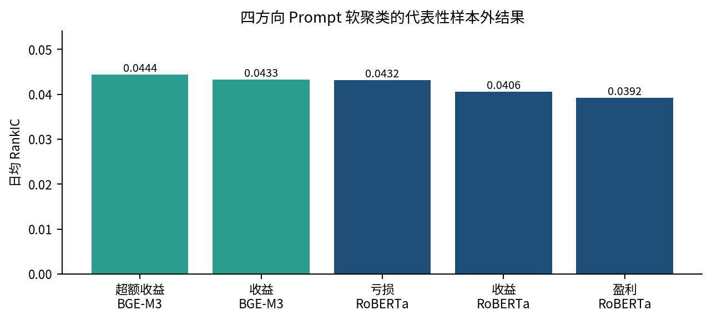
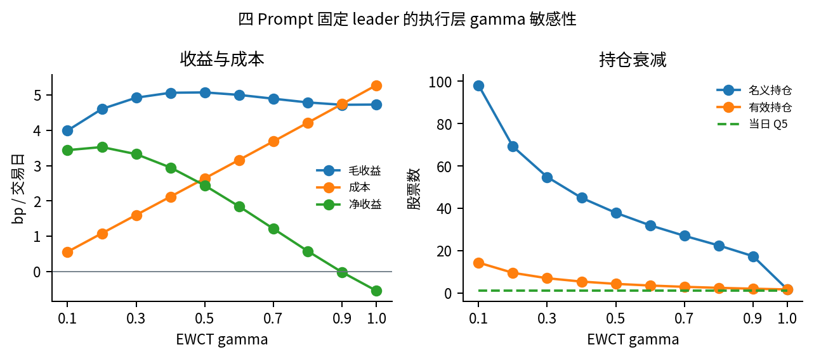
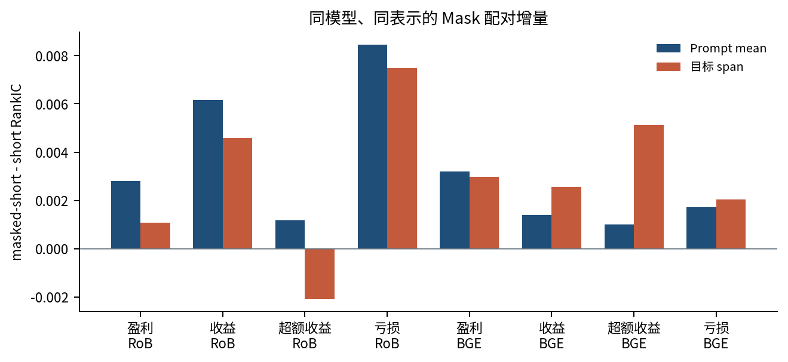
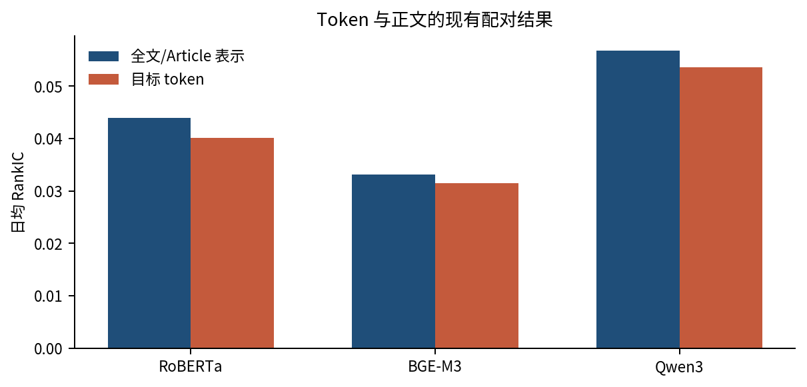
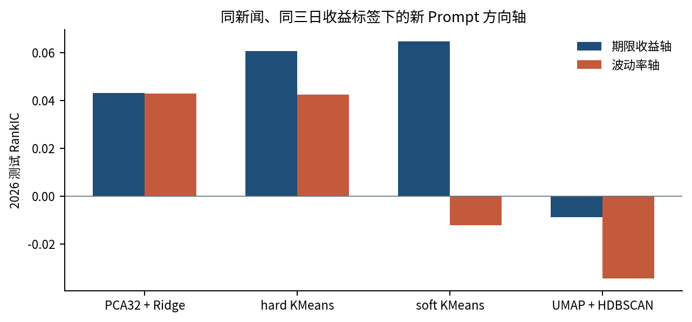
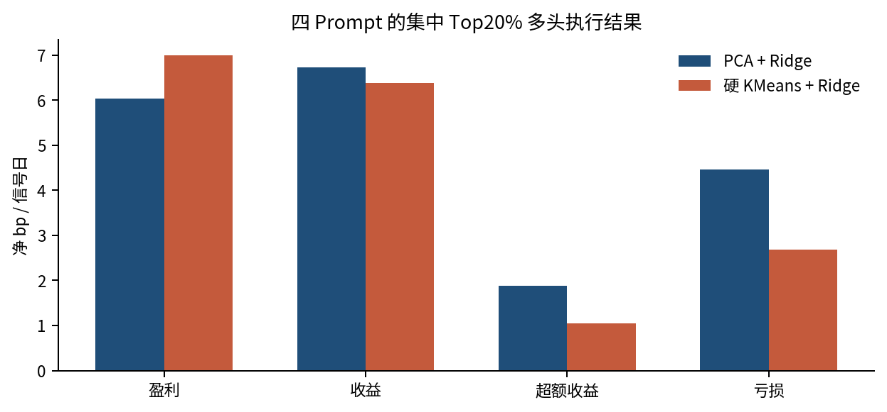
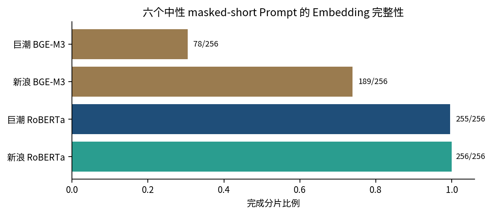

# 中国市场 Prompt Token 与新闻收益预测研究报告

从全文表示到目标 token：新浪新闻、巨潮公告与三代中文文本模型的严格样本外研究

本报告系统记录 2010--2026 年中国股票新闻与公告的文本表示、Prompt 机制、目标
token、PCA、聚类、收益预测和风险标签研究。研究重点不是寻找单个最高回测值，而是
回答：在相同新闻、相同标签、相同历史窗口和相同降维协议下，目标 token 相对正文
是否提供可重复增量，以及这种增量能否跨模型、Prompt、数据源和年份成立。

研究范围：新浪新闻 796,553 条、巨潮公告 903,665 条及旧新浪严格对齐样本 75,894 条 
数据截至：新浪 2026 年 8 月 18 日，巨潮 2026 年 7 月 31 日 
事实冻结：2026 年 8 月 26 日 
报告性质：研究报告，不构成投资建议或可部署策略声明

## 目录

[TOC]

<!-- PAGEBREAK -->

## 1. 引言：研究问题与主要发现

新闻全文向量能够压缩公司经营、订单、监管、盈利和风险信息，但全文池化也会把大量
与预测任务无关的语句平均进去。Prompt 提供了一个受控的语义查询：同一篇新闻在
“分析股票收益”“分析股票亏损”等条件下产生不同的上下文化 token。如果目标 token
确实定位了任务相关语义，它应当在严格时间外预测中相对正文产生增量；如果它只反映
词形、长度或模型位置结构，则相似度变化不应被解释为经济理解。

本项目因此沿两条互补路线展开。第一条复现“冻结文本模型加轻量监督预测头”的论文
骨架，建立新闻/公告到未来收益的滚动预测。第二条把研究单位从整篇 pooled embedding
推进到 Prompt 的精确目标 span，比较 RoBERTa、BGE-M3 和 Qwen3-Embedding-8B 的
token、正文及模型间融合。为了减少公司身份记忆和时间泄漏，新增实验只采用
`masked_short`，只 mask 公司名、代码、日期和时间。

本文统一术语如下：RankIC 是每天预测排序与实现目标排序的 Spearman 相关再按日平均；
严格 6+2+1 表示 6 年训练、2 年验证、1 年测试；PCA、标准化、聚类器和监督模型都只能
在当前历史窗口拟合；`body_mean` 是正文 token 平均，`prompt_mean` 是 Prompt 槽位平均，
目标 token 是排除前缀、句号、separator 和 special token 后的精确目标 span。

研究得到七项主要发现。

1. **文本表示中存在跨年的弱收益排序信息。** 新浪 `event_return_3d` 当前最高跨年
   RankIC 为 0.08945，来自 RoBERTa 和 BGE-M3 各自 PCA64 后拼接的 masked“收益”
   span Ridge；新浪 `next_day_return` 当前最高为 0.06044，来自 RoBERTa masked
   `分析股票收益` 的 `prompt_mean` Ridge，均为 9/9 个测试年正。
2. **Prompt token 能区分任务视角，mask 在配对线性结果中多数有效，但不存在一个词在所有口径都最好。**
   无聚类 Ridge 的 `prompt_mean` 在 mask 后 8/8 配对改善，平均 RankIC 增量 +0.00324；
   目标 span 为 7/8 改善、平均 +0.00297。四方向软聚类最高单配置是 BGE-M3“超额收益”
   0.04439；跨配置平均由“收益”领先；固定成本后只做多由
   BGE-M3 masked“亏损”领先，净 3.63 bp/交易日、年化 8.30%、Sharpe 0.595。尚缺
   位置匹配的无 Prompt 反事实，不能把它表述为加入 Prompt 的因果增量。
3. **Token 的模型结构差异是真实的，但不能直接等同于理解能力。** 在 30,946 个共同
   股票日上，RoBERTa 四 Prompt token 因子平均相关约 0.653，BGE-M3 约 0.892；历史
   `full_mean` 因子则分别约 0.997 和 0.972。RoBERTa 更 prompt-specific，BGE-M3 更平滑，但哪个
   更有用仍必须由同样本的样本外增量判定。
4. **Qwen token 尚未整体超过正文。** 当前新浪 PCA32 结果中，Qwen masked“收益”
   token RankIC 为 0.05360，低于 masked article mean 的 0.05680；成本后年化 7.37%
   也低于正文 8.57%。局部软聚类更强不足以改写这一总体结论。
5. **聚类主要是结构诊断，不是稳定的主预测器。** 四方向硬 KMeans 相对同 PCA Ridge
   的平均 RankIC 增量为 -0.00026，仅 6/16 胜；Top20% 多头也由线性的 4.77 降至
   4.28 净 bp/信号日。UMAP+HDBSCAN 在一个 BGE-M3 loss 输入上把无成本多空从
   14.96 提高到 19.72 bp/信号日，但每腿平均不足 5 只，仍是局部结果。软聚类固定因子
   在 `gamma=1` 时毛收益仍为 4.73 bp/日，但成本后为 -0.55 bp，说明慢调仓是经济结果的
   关键组成部分。
6. **新 Prompt 在同一收益标签上呈现任务相关差异，但证据仍是单年。** 2026 同新闻、
   同三日收益标签下，期限收益轴 token 在 PCA Ridge、硬 KMeans、软 KMeans 和
   UMAP+HDBSCAN 四种方法中都高于波动率轴，四方法平均 RankIC 为 0.03987 对
   0.00967；但线性 PCA Ridge 仅为 0.043105 对 0.042975。匹配标签实验中，估值
   token 对下一日 PE 相对偏离为 0.0764，波动率 token 对下一日实现波动率为 0.0553。
7. **当前最关键的结论仍未完成验证。** 三模型、四 Prompt、token/body 的严格共同样本
   PCA32 比较已经设计，但尚未产生完整结果。因此不能写成“Qwen 已经证明兼顾共同语义
   和细粒度差别”，也不能写成“token 普遍优于正文”。

当前证据支持一个审慎判断：**目标 token 是有条件的文本因子候选，其价值依赖模型、
Prompt、标签和监督方法；现阶段最可靠的预测器仍是严格滚动的低维线性模型。**

## 2. 文献基础与本地研究任务

### 2.1 工作区原始论文

本项目的文献依据来自工作区内五份原始 PDF，而不是二手摘要。报告仓库不再分发 PDF，
但 `references/papers_manifest.tsv` 保存文件名、页数、书目信息和 SHA256，可逐份核验。

| 研究 | 原始文件 | 核心方法或问题 | 本项目借鉴 |
|---|---|---|---|
| Chen、Kelly、Xiu，*Expected Returns and Large Language Models* | `ExpectedReturns_LLMs.pdf` | 冻结语言表示、收益监督、16 市场/13 语言、6+2+1 年度滚动 | 主滚动协议、文本表示与预测头分离、样本外组合 |
| Yang，*Investor Sentiment in the Chinese Stock Market* | `Phd_thesis_Zhijiao_Yang_20219273_.pdf` | 中国市场情绪、横截面检验、成本、卖空限制与百度指数 | A 股约束、只做多/理论多空分开、关注度控制 |
| Jiang 等，*Deep learning, textual sentiment, and financial market* | `Deep_learning_textual_sentiment_and_financial_mark (1).pdf` | 以收益标签训练 BERT 情绪，市场级月度预测 | 收益监督文本表示、非线性和状态异质性 |
| Zhang，中文 BERT 情绪与股票相关研究 | `2205.04743v1.pdf` | 2019--2020 东方财富股吧、BERT 与 MIC | 中文语义和非线性相关的探索价值 |
| Wang，*Topic Modeling in Finance* | `134c5fadcdf98503b93ac0ef93b4f0a41b8d.pdf` | 金融 topic model 与聚类综述 | 聚类作为结构诊断，避免用 silhouette 代替收益证据 |

Chen、Kelly、Xiu 的第 20 页明确使用 6 年训练、2 年验证、1 年测试。Jiang 等报告的
2001--2021 年 550 万余条新闻和月度样本外 R² 8.39% 是市场级月度结果，不能与本项目
个股日频 RankIC 直接比较。不同频率、预测对象和评价指标必须分别说明。

### 2.2 从论文骨架到本地研究问题

| 层次 | 本地问题 | 主要比较 | 当前状态 |
|---|---|---|---|
| 全文基线 | 新闻/公告全文是否预测未来收益 | `body_mean/full_mean` + Ridge/Huber/MLP | 新浪、巨潮均已有结果 |
| Prompt 条件 | 加入简短任务词是否改变表示 | short 与 masked-short、Prompt 间配对 | 历史四方向完成 |
| Token 定位 | 精确目标 span 是否优于正文 | token 对 `body_mean/article_mean` | Qwen article 对照完成；两 encoder 的历史表实际为 `full_mean`，true body 待完成 |
| 几何结构 | 模型是否把四个词表示为共同语义 | cosine、centered cosine、CKA、ARI | 部分完成，统一三模型待完成 |
| 语义因子 | 估值、波动率、流动性等是否预测匹配标签 | 三点轴与风险/估值目标 | 2026 单折探索完成 |
| 模型融合 | 多 Prompt、多模型是否产生非线性增量 | Ridge/ElasticNet/HistGB late fusion | 设计和部分旧结果，公平比较待完成 |

### 2.3 本地创新不是机械复刻

原论文研究完整新闻向量，本项目进一步研究 Prompt 目标 token 的机制。新增设计包括：

- 用 `masked_short` 删除公司身份、代码、日期和时间，但保留目标语义词；
- 明确区分 Prompt 前缀、目标 span、正文、separator 和 special token；
- 对 RoBERTa/BGE-M3 使用真正的 `body_mean`，对 Qwen 使用 `article_mean`；
- 双向模型的后置 Prompt 可能影响正文表示，因果 Qwen 的后置 Prompt 不反向影响正文；
- 三模型原始维度 768/1024/4096 不直接共享坐标，只统一算法、PCA 维数和历史窗口；
- 从收益扩展到估值、确定性、波动率、冲击、流动性和风险，但要求标签语义匹配。

## 3. 数据资产与清洗方法

### 3.1 数据来源与采集链

本项目的两套主文本来自不同信息生成机制。新浪财经是媒体新闻，适合研究新闻叙事、市场
注意力和价格反应；巨潮资讯是上市公司官方公告，适合研究法定披露和事件冲击。东方财富
与雪球只作为公开可见投资者内容的补充，不与主面板混合。

| 来源 | 采集方式 | 当前用途 | 运行边界 |
|---|---|---|---|
| 新浪财经 | 浏览器发现历史 seed；普通 HTTP depth-3、去重、depth-5 扩展 | 新闻主面板 | 联网采集只能本地运行；集群只处理校验后文件 |
| 巨潮资讯 | 官方可见公司页、日期筛选、分页、详情、公开 PDF 下载和文本抽取 | 公告主面板 | 不调用隐藏接口，访问控制出现即停止 |
| 东方财富 | 可见要闻、个股页、公告、研报、股吧 | 情绪/注意力控制 | 页面间隔至少 3 秒，有界批次 |
| 雪球 | 可见讨论、资讯和公告 feed | 情绪/注意力控制 | 匿名或显式授权 browser state |

新浪采用混合方式：浏览器渲染更适合找到动态历史入口和缺失年份，普通 HTTP 更适合批量
正文、原始 HTML 留存和断点恢复。自动 HTTP runner 当前为 20 workers、1 秒批次 pause、
30 秒 timeout，先 depth 3、正文哈希去重，再 depth 5。浏览器 selector 默认 8 pages、
3 秒 pause、500ms render wait；年度补洞默认 4 年任务 x 每年 2 pages。20 workers 是并发
上限而非 20 页/秒。现有普通 DFS 2 页/0.38 秒、浏览器 BFS 4 页/4.90 秒和 DFS
4 页/4.77 秒都只是可运行性微探针，不能外推全量吞吐。

巨潮 2010--2017 采集审计覆盖 816 股票 x 8 年，共 6,528 个股票年且全部完成，原始
完成文件有 554,451 条记录。采集器保存公告索引、详情状态和 PDF；后续才进行 PDF 文本
抽取、document ID 去重、清洗、分类与收益对齐。最终 903,665 行面板不是原始下载量。

### 3.1.1 巨潮目前爬取范围：技术范围与已完成范围不是一回事

巨潮采集器的单股票参数是 `CODE:ORG_ID:NAME`。只要股票在巨潮公开公司披露页可以解析出
`stockCode` 和 `orgId`，就可以按日期筛选、遍历分页、打开详情页并下载公开 PDF；因此
技术上可爬取的是可被公开页面识别的上市公司公告，而不是固定的 816 只股票。当前完整
历史审计没有宣称覆盖全 A 股，实际采用的是研究股票池与收益面板的交集：
`data/stock_universe_paper_1000.csv` 的 1,000 个候选中，最终有 816 只进入完整审计。

| 范围口径 | 股票数量 | 说明 |
|---|---:|---|
| 研究候选池 | 1,000 | 论文/收益研究预先固定的候选股票，不等于巨潮全市场 |
| 当前完整历史审计 | **816** | 候选池与清洗公告/收益标签可对齐的交集 |
| 交易所构成 | 沪市 64、深市 752 | 当前面板没有纳入北交所股票 |
| 代码前缀 | `000/001/002/300`、`600/601/603/688` | 具体数量冻结在 `facts.json`，不是按前缀推断公告存在 |
| 历史股票年 | 816 x 8 = **6,528** | 2010--2017，6,528/6,528 股票年完成 |

当前 816 只股票的 2010--2017 采集由 `run_cninfo_historical_local.sh` 分年执行，每个
股票单独输出 JSON、详情状态和 PDF；完成文件原始记录 554,451 条。清洗阶段再进行 PDF
文本抽取、公告 URL/document ID 去重、正文长度过滤、分类和收益对齐，所以最终
2010--2026 分类面板的 903,665 行不能理解为“本次爬虫一次下载了 903,665 份 PDF”。
2018--2026 的面板记录来自已有公告源并入同一清洗/标签合同；如要扩展到全 A 股，需要先
建立新的股票目录、为每只股票解析 orgId、做小批量可见页探针，再按股票年审计缺失，不能
直接把 `--expected-stocks` 从 816 改成全市场。

单股票 collector 支持 `--index-only` 只保存可见索引，也支持 `--focus-only` 仅保留
业绩、分红、回购、重组、合同、诉讼、监管等研究标题。正式全量口径使用索引、详情和公开
PDF，失败、空 PDF、访问控制和导航超时都写入状态，不把失败记录填成空正文；因此可以
区分“没有公告”“页面访问失败”和“PDF 无可抽取文本”。

### 3.1.2 新浪为什么必须在本地，以及实际爬取逻辑

“新浪只能本地抓取”是本项目的数据源访问和可复现约束，不是 embedding 或 CPU 任务限制。
新浪页面的历史入口、编码和可见内容需要浏览器/HTTP 的真实访问上下文；在集群节点分布式
发起联网请求会带来访问控制、限速、IP/会话不一致和无法复现的问题。因此规定：本地机器
完成种子发现、页面请求和原始文件落盘，集群只接收本地生成并校验过的 HTML/JSONL/state/
manifest/checksum，进行清洗、embedding 和回归；不在 Slurm CPU/GPU 节点联网抓取。

新浪的完整逻辑是“本地浏览器发现 + 本地普通 HTTP 扩展 + 本地去重/清洗”：

1. **发现种子**：浏览器打开公开可见的历史新闻入口、频道和年份页面，记录 URL、父链接、
   年份、股票匹配、正文长度和正文 hash。按照股票、年份、季度、频道路径和标题差异做
   farthest-first，避免所有 seed 集中在热门股票或单一年份。
2. **第一轮扩展**：从人工/浏览器 seed 运行普通 HTTP depth-3 图搜索，使用有界
   `ThreadPoolExecutor`，保存 raw HTML 和逐行 records；robots/访问异常/超时进入 state，
   不无限重试。
3. **解析与初筛**：按 HTTP/meta charset 识别 GBK/GB18030 等历史编码，解析标题、时间、
   正文和链接；正文保留 120--12,000 字符，股票关联同时使用页面股票链接、显式代码和公司
   名称词典。
4. **全局去重**：先按规范化 URL 去重，再按正文 SHA256 去重；不能只按标题去重。当前
   runner 还排除明确识别为 2000 年的异常记录。
5. **第二轮扩展**：把去重后的有效文章 URL 写成新的 roots，再运行 depth-5 HTTP 扩展，
   解决文章互相链接但第一轮尚未到达的问题；第二轮同样保存 state、manifest 和失败状态。
6. **年度补洞**：普通 HTTP 找不到动态入口或年份断档时，使用浏览器年度 runner 按年独立
   队列补洞；每年单独输出，最后合并前按 URL/body hash 去重并检查年份分布。
7. **交接与集群处理**：本地跑完后复制 raw/records/state/manifest/checksum 到 Lustre，
   先验 hash 和行数，再由集群做文本清洗、mask、tokenizer preflight、embedding 和滚动回归。

推荐的本地命令是 `scripts/run_sina_auto_pipeline.py`：默认 20 个 HTTP workers、批次间隔
1 秒、单请求 30 秒、depth-3 后 depth-5；浏览器 selector 默认 8 个页面、3 秒间隔和
500ms 渲染等待。20 workers 是并发上限，不是 20 页/秒；正式吞吐必须以带 summary 的
本地长跑测量，不能用 2--4 页微探针外推全量容量。每次修改 parser 或参数后，都应使用新
output-dir/manifest 版本，避免不同规则的 records 混在同一 frontier state 中。

### 3.2 三套不可混用的样本

| 样本 | 期间 | 行数 | 股票数 | 主要用途 |
|---|---|---:|---:|---|
| 新浪全量清洗面板 | 2010-01-01 至 2026-08-18 | 796,553 | 5,466 | 六中性 Prompt 全量 embedding、后续标签研究 |
| 巨潮全量公告面板 | 2010-01-03 至 2026-07-31 | 903,665 | 816 | 全量公告 pooled/Prompt、估值和风险标签 |
| 旧新浪单股对齐面板 | 2010-01-01 至 2026-08-16 | 75,894 | 5,085 | 四方向 Prompt 的历史 RoBERTa/BGE/Qwen 研究 |

三套样本的 `row_index` 都在各自面板内唯一，但含义不同。全量新浪和巨潮不能沿用旧
75,894 条面板的行号。三模型四 Prompt 构建器预期的冻结最小交集为新浪 35,576 条、
巨潮 254,544 条；这是构建时必须核对的预期值，不是已经完成的最终分析样本。

### 3.3 年度分布

| 年份 | 新浪全量 | 巨潮全量 | 旧新浪对齐 |
|---:|---:|---:|---:|
| 2010 | 17,741 | 49,255 | 3,849 |
| 2011 | 20,264 | 50,982 | 4,342 |
| 2012 | 14,658 | 56,101 | 3,635 |
| 2013 | 5,682 | 59,963 | 2,100 |
| 2014 | 1,320 | 71,882 | 448 |
| 2015 | 2,120 | 86,714 | 686 |
| 2016 | 7,797 | 90,227 | 1,463 |
| 2017 | 6,884 | 87,964 | 1,459 |
| 2018 | 33,170 | 39,524 | 5,171 |
| 2019 | 66,774 | 38,070 | 8,097 |
| 2020 | 85,195 | 39,675 | 5,369 |
| 2021 | 82,768 | 41,081 | 3,478 |
| 2022 | 74,865 | 42,669 | 2,969 |
| 2023 | 47,643 | 45,543 | 2,104 |
| 2024 | 60,843 | 39,929 | 2,744 |
| 2025 | 59,885 | 42,219 | 3,524 |
| 2026 | 208,944 | 21,867 | 24,456 |

新浪 2026 年占比明显上升，巨潮 2010--2017 的公告量明显高于 2018 年以后；这类来源
和采集结构漂移必须通过年度滚动、逐年指标和固定新闻池诊断，不能把全期随机切分作为主结果。

### 3.4 文本与标签覆盖

新浪正文清洗字符数中位数为 2,579，90 分位为 9,384，固定最大清洗长度为 12,000 字；
796,553 条中有 646,222 条 next-day 标签和 643,517 条 event-3 标签。巨潮正文字符数
中位数 1,765，90 分位 11,737；882,610 条至少有 100 字，895,251 条有 next-day 标签，
894,851 条有 event-3 标签。

巨潮 903,665 条只覆盖当前面板中的 816 只股票。因此“公告条数大”不等于“横截面更广”。
新浪覆盖 5,466 只股票，但不同年份和来源的有效覆盖不均。报告中的模型比较必须同时冻结
新闻行、股票日、标签可用性和测试年份。

<!-- PAGEBREAK -->

### 3.5 Mask 与点时约束

`short` 保留清洗正文中的身份和时间字段；`masked_short` 在相同短 Prompt 下只处理下表
四类字段。这里的“mask”是一个完整文本处理 treatment，不等于模型内部 attention mask。

| 文本元素 | 是否 mask | 理由 |
|---|---|---|
| 公司全称、简称和可识别公司身份 | 是 | 降低模型依赖公司记忆或固定身份效应 |
| 股票代码 | 是 | 避免代码成为公司 ID 的直接代理 |
| 日期与具体时间 | 是 | 降低时间记忆、格式捷径和显式日期泄漏 |
| Prompt 目标词，如盈利、收益、亏损、风险、估值 | **否** | 目标 span 是研究对象，删除后任务定义失效 |
| 新闻中的经营、财务、事件和方向内容 | **否** | 保留真正需要编码的经济信息 |

概念上，`某公司（000001）于某日宣布盈利改善` 只把公司、代码和日期替换为统一占位，
“盈利改善”继续可见。新增中性 Prompt 每行保存稳定 `row_index`、`document_id`、股票代码、
发布时间、正文哈希和 Prompt spec；tokenizer preflight 另存 prompt IDs、目标 span 和截断合同。
历史四方向配对使用已完成的 short/masked-short 产物，行和标签相同，但 masking 会改变输入
token 上下文，这正是配对 treatment 的组成部分。因此它识别的是“移除四类身份/时间字段的
总效果”，不能进一步归因到公司名、代码或日期中的某一个字段。

mask 的第一职责是控制身份与时间捷径，不是天然的模型增强。若未来要检验严格点时性，
还应逐条验证正文中公告日期、报告期和相对时间表达是否属于事件内容；这些经济日期不能在
没有规则审计的情况下全部删除。

## 4. Embedding、训练与评价流程

### 4.1 模型、输入布局与表示

| 模型 | 模型来源/runner ID | 结构 | 原始维度 | 本轮输入上限 | 正文表示 |
|---|---|---|---:|---:|---|
| 中文 RoBERTa | `hfl/chinese-roberta-wwm-ext` | 双向 encoder | 768 | 512 | `body_mean` |
| BGE-M3 | `BAAI/bge-m3` | 双向多语言 embedding encoder | 1,024 | 1,000 | `body_mean` |
| Qwen3-Embedding-8B | Ollama/GGUF `qwen3-embedding:8b` | 因果模型 | 4,096 | 500 | `article_mean` |

六个中性 Prompt 固定为：`分析股票估值`、`分析股票确定性`、`分析股票波动率`、
`分析股票冲击`、`分析股票流动性`、`分析股票风险`。不添加“请”“综合分析”、高中低
或无意义 padding。RoBERTa/BGE-M3 输出同时保存 prompt/title/body/full 的 mean/max、
CLS 和 `prompt_token_embeddings`，因此不是只保存 Prompt token。

#### 4.1.1 Prompt 与正文如何隔断

实现不是三模型共用一个字符串模板，而是两种不同的序列合同：

- RoBERTa / BGE-M3：`[BOS] → Prompt → 标题 → 正文 → [EOS]`；
- Qwen3-Embedding-8B：`标题正文 → \n\n → Prompt → [EOS]`。

| 项目 | RoBERTa / BGE-M3 | Qwen3-Embedding-8B |
|---|---|---|
| Prompt 位置 | 正文前 | 正文后 |
| 模型可见的 Prompt/正文 separator | **没有额外 separator token** | 双换行 `\n\n`；已审计 GGUF 中为 1 token |
| 标题/正文 separator | 没有额外 token，只保存内部段标签 | 标题和正文直接拼成 article |
| 段标签 | `segment_id=0/1/2` 只用于输出池化，不作为 `token_type_ids` 传给模型 | 由位置和双换行确定边界 |
| 注意力方向 | 双向：Prompt、标题和可见正文互相上下文化 | 因果：Prompt 可看此前正文，正文不能看后置 Prompt |
| 超长处理 | 从序列尾部截断；优先保留 Prompt/标题，正文尾部及可能的 EOS 被截去 | 先为 separator、Prompt、EOS 预留预算，再截断 article |

因此 RoBERTa/BGE-M3 的“隔断”是**池化边界**而非模型注意力边界：模型仍把相邻 Prompt、
标题和正文作为一个连续序列处理。Qwen 的双换行是模型可见边界，同时由于因果注意力，
`article_mean` 的每个 article token 都位于 Prompt 之前，不会被后置 Prompt 反向改变。

相同中文也不是相同 token。以收益 Prompt 为例，实际 tokenizer 审计为：RoBERTa 的
`分析股票收益` 是 `分/析/股/票/收/益` 六个 token；BGE-M3 是
`▁/分析/股票/收益` 四个 token；Qwen 输入为 `分析股票收益。`，是
`分析/股票/收益/。` 四个 token。跨模型比较的是相同算法和样本外统计，不是相同 token
数量或原始 embedding 坐标。

#### 4.1.2 `prompt_mean`、目标 token、`body_mean` 和 `full_mean`

令最后一层上下文化 hidden state 为 `h_i`，各表示只改变取哪些位置平均：

| 表示 | 计算位置 | 是否包含 Prompt | 解释 |
|---|---|---:|---|
| `prompt_token_embeddings` | 保存每个 Prompt 位置的 `h_i`，形状为 `N × P × D` | 是 | 这是张量，不是单一向量 |
| 目标 token/span | `mean(h_i, i∈目标词位置)` | 只含目标词 | 例如只取“收益”；多 token 目标取 span 均值 |
| `prompt_mean` | `mean(h_i, i∈全部 Prompt 位置)` | 是 | 同时混合“分析”“股票”和目标词；Qwen 历史输入还含句号 |
| `body_mean` | `mean(h_i, i∈正文段)` | 不直接池化 Prompt | RoBERTa/BGE-M3 中正文 hidden state 仍受前置 Prompt 双向影响 |
| `article_mean` | `mean(h_i, i∈Qwen 标题+正文)` | 否 | 因果结构下不受后置 Prompt 影响 |
| `full_mean` | `mean(h_i, i∈Prompt+标题+正文)` | 是 | 不能命名为 `body_mean` |
| `title_body_mean` | `mean(h_i, i∈标题+正文)` | 不直接池化 Prompt | 双向模型中仍是 Prompt-conditioned 正文表示 |

这里的 `N × P × D` 是数组形状，不是把三个数相乘后得到一个指标：

- `N`：该文件中的新闻/公告条数，一行对应一篇输入；
- `P`：该 Prompt 保存的 token 位置数，不同 tokenizer 和 Prompt 可以不同；
- `D`：模型 hidden size，RoBERTa/BGE-M3/Qwen 分别为 768/1,024/4,096。

例如 RoBERTa 的 `分析股票收益` 有六个目标 Prompt token，所以一个含 `N` 条新闻的文件是
`N × 6 × 768`；第 `n` 条新闻、第 `p` 个 Prompt token 对应一个 768 维上下文化向量。
BGE-M3 的同一句审计为四个 Prompt token，对应 `N × 4 × 1,024`。选取“收益”目标位置并
对多 token span 求均值后，数组由 `N × P × D` 变成 `N × D`；`prompt_mean` 则对全部
`P` 个 Prompt 位置平均，同样得到 `N × D`，随后才进入训练期 PCA 和回归。

所有 mean 都排除 BOS/EOS、padding 和不可见位置。目标 `token_embedding` 也不是词典中的
静态 token embedding，而是**整篇输入前向计算后的最后一层上下文化 hidden state**。
Qwen 的 `prompt_mean` 对历史四词任务平均全部 Prompt token，包括末尾句号；“收益”token
只选 `收益`，排除“分析”“股票”和句号。

### 4.2 两模型四方向 Prompt 的同口径收益统计

上一版在模型介绍表中混放了新浪/巨潮、next-day/event/O2O 和不同表示，不能用于判断
prompt 收益能力。下面改用现有最完整的严格可比表：旧新浪共同面板、2018--2026 的
6+2+1 滚动、`next_day_return`、`masked_short`、各 prompt 历史 direction span、无聚类
线性 Ridge。`late_fusion` 是历史文件名，表中四行均为独立 prompt 预测。

| Prompt / 历史 direction span | RoBERTa RankIC | BGE-M3 RankIC | RoBERTa - BGE |
|---|---:|---:|---:|
| 盈利 | 0.05430 | 0.03812 | +0.01618 |
| 收益 | 0.05394 | 0.03556 | +0.01838 |
| 超额收益 / 实际取“超额” | **0.05644** | 0.03720 | +0.01923 |
| 亏损 | 0.05479 | 0.03431 | +0.02048 |

四个 prompt 在两个模型中均为正，且该口径下 RoBERTa 全部高于 BGE-M3。RoBERTa
内部由“超额收益”最高，BGE-M3 内部由“盈利”最高；“收益”并非每个模型的最高点。
因此这张表支持方向词 token 含有收益排序信息和模型差异，不支持某个方向词普遍最优。
四词平均 RankIC 为 RoBERTa **0.05486**、BGE-M3 **0.03630**。这里的 RankIC 是每个
测试日横截面 Spearman IC 的平均，不是回归系数；表中没有把九年收益组合、成本或 Sharpe
混入同一个数。
来源为 `reports/prompt_cluster_token_comparison.json` 中
`method_family=linear_ridge, variant=masked_short` 的八个配置。

### 4.3 四方向 Prompt 的 span 定义

| Prompt | 目标 span | 说明 |
|---|---|---|
| `分析股票盈利` | `盈利` | 取语义字符 span；实际 token 数由各模型 tokenizer 决定 |
| `分析股票收益` | `收益` | 取语义字符 span；不包含“分析股票” |
| `分析股票超额收益` | `超额` | **本报告历史 word-span 结果只取“超额”**；不是完整目标短语 |
| `分析股票亏损` | `亏损` | 取语义字符 span；不包含“分析股票” |

历史结果必须保留原有 span 定义，不能事后把“超额”改写成“超额收益”。新的三模型公平
比较才使用完整目标短语，并在
manifest 中保存 input IDs、tokens、offset mapping、目标 token 索引和 Prompt hash。

### 4.4 Benchmark 层级

原始论文的主骨架是冻结文本表示、简单监督头、严格滚动和组合检验。本项目按以下顺序
区分 benchmark 与扩展，防止把模型复杂度误当作 prompt 信息：

1. 非文本控制：过去收益、规模、成交量和历史波动率；
2. 传统文本：情绪词典、TF-IDF + Ridge、Word2Vec；
3. 整文 Transformer：真正的 `body_mean/article_mean`；
4. prompt pooled：`prompt_mean/full_mean`；
5. 目标 token：精确 span；
6. 扩展：mask、硬/软聚类、密度聚类和预测级融合。

当前公平比较的直接 benchmark 固定为同一新闻交集上的训练期 PCA32 + Ridge alpha 100。
每个 token/body/聚类配置都与它配对；不做原始 768/1024/4096 维回归，不因最终测试
结果切换 PCA 维数。历史 PCA64/raw 结果保留为历史证据，但不混入新主表。

### 4.5 时间切分与固定参数

新浪主结果使用严格 6+2+1，测试年 2018--2026。巨潮三模型公平比较因历史 embedding
交集限制，基础预测采用 3 年历史加 1 年测试，并在历史窗口内保留 1 年 OOS 供二级融合。
语义轴与高频标签的现有探索使用 2018--2023 训练、2024--2025 验证、2026 测试；高频
标签 2018--2020 为空，因此实际有效训练年为 2021--2023。

当前公平比较预注册参数为 PCA32、`random_state=42`、Ridge alpha 100、KMeans k=6、
seeds 17/29/42/71/113、soft shrinkage 500、temperature 0.5、UMAP8 和 HDBSCAN
`min_cluster_size=50, min_samples=10`。不做原始维回归，也不根据九年最终结果改参数。

### 4.6 评价指标

主指标为日均 RankIC、RankIC IR、逐年 RankIC、正 RankIC 年份数、月度正 RankIC 比例
和日期区块 bootstrap 区间。辅助指标为同新闻池 Top20% 超额、多空收益、Accuracy、
样本外 R²、成本后年化/Sharpe/回撤、因子 Spearman 相关和 Top20% 选股重合率。

Embedding cosine、centered cosine、CKA、ARI 和 silhouette 只描述表示结构，不能选择
收益模型。三模型原始坐标不可直接比较；跨模型只比较标准化几何统计和完全样本外因子。

### 4.7 组合与成本

四方向历史成本回测固定 `gamma=0.1`，买入和卖出各 5bp。只做多、独立做空和多空必须
分别报告。A 股缺少逐股券源、借券费和召回数据时，任何空头腿都是理论诊断，不能称为
可部署策略。`simple_states` 返回 `ErrorCode=1002` 的结果只作为统一平台对照，不替代
正式成本回测。

组合评价不能只看 RankIC。本报告同时冻结：日均毛收益、日均交易成本、日均净收益、
实际持仓数、新信号数、换手、净 Sharpe 和最大回撤。`bp/交易日` 使用逐日收益直接取均值，
不是由年化收益倒推。不同执行器的成本和持仓规则不得混表：旧线性/硬聚类 Top20% 模拟按
年重置、买入 5bp/卖出 10bp；软聚类正式组合使用 `gamma=0.1`、无信号继续持仓；密度聚类
股票日模拟未扣成本。

## 5. 新浪四方向 Prompt 方法验证

### 5.1 完成范围

旧新浪 75,894 条母面板上，四个 Prompt、两个模型、short/masked-short 两个变体、
九个测试年共 144 个独立软聚类 fold，已完成 144/144。每个 fold 的 PCA 维度、簇数、
收益响应、收缩和温度只由验证期选择，测试前再用训练加验证拟合。

### 5.2 样本外排序

| 配置 | 日均 RankIC | 正年份 | 正月份 |
|---|---:|---:|---:|
| 超额收益 / BGE-M3 / short / RankIC 选择 | 0.04439 | 9/9 | 72/104 |
| 收益 / BGE-M3 / short / RankIC 选择 | 0.04327 | 9/9 | 70/104 |
| 亏损 / RoBERTa / short / RankIC 选择 | 0.04317 | 8/9 | 65/104 |
| 收益 / RoBERTa / short / RankIC 选择 | 0.04061 | 9/9 | 74/104 |
| 盈利 / RoBERTa / masked-short / RankIC 选择 | 0.03920 | 9/9 | 70/104 |

图 1. 四方向 Prompt 软聚类的代表性样本外 RankIC。图中配置不是同一 Prompt 的因果实验。

四个 Prompt 各自八种配置平均后，“收益”RankIC 为 0.03529，“亏损”0.03164，
“超额收益”0.03034，“盈利”0.02995。最高单配置与跨配置平均不是同一问题。

### 5.3 无聚类线性基线

无聚类 Ridge 中，每个 Prompt 的八种配置来自两个模型、short/masked-short 和
`prompt_mean`/目标 span。下表同时给出配置平均和各 Prompt 自身最佳点，避免只展示一个
winner。

| Prompt | 八配置平均 RankIC | 最佳配置 | 最佳 RankIC | 正年份 |
|---|---:|---|---:|---:|
| 盈利 | **0.04480** | RoBERTa masked `prompt_mean` | 0.05791 | 9/9 |
| 收益 | 0.04393 | RoBERTa masked `prompt_mean` | **0.06044** | 9/9 |
| 超额收益 | 0.04385 | RoBERTa short “超额”span | 0.05851 | 9/9 |
| 亏损 | 0.04281 | RoBERTa masked `prompt_mean` | 0.05957 | 9/9 |

四 Prompt 平均差仅 0.00199，而最佳单配置的词和变体并不相同。它说明四词都含收益排序
信息，Prompt 选择与模型/表示存在交互；不能由“收益”的 0.06044 推导出“收益这个词在
所有模型和组合指标都最好”。更详细的 mask 配对见 5.6，Prompt 本身的因果边界见 5.7。

### 5.4 成本后的不同答案

下表逐 Prompt 选择现有固定 `gamma=0.1`、5bp 成本回测中净 Sharpe 最高的只做多配置。
它是事后描述性 leader，不是测试期可重新选择的单一部署策略。

| Prompt | 配置 | 毛 bp/日 | 成本 bp/日 | 净 bp/日 | 名义持仓 | 有效持仓 | 当日 Q5 | 换手/日 | 净 Sharpe |
|---|---|---:|---:|---:|---:|---:|---:|---:|---:|
| 盈利 | RoBERTa masked / 多空验证目标 | 3.65 | 0.56 | 3.10 | 101.8 | 14.66 | 1.10 | 5.58% | 0.468 |
| 收益 | BGE-M3 masked / 多空验证目标 | 4.01 | 0.55 | 3.46 | 89.9 | 13.93 | 1.10 | 5.53% | 0.537 |
| 超额收益 | RoBERTa masked / 多空验证目标 | 4.13 | 0.56 | 3.57 | 103.6 | 15.11 | 1.10 | 5.61% | 0.526 |
| 亏损 | BGE-M3 masked / RankIC 验证目标 | 4.18 | 0.55 | **3.63** | 97.4 | 13.90 | 1.10 | 5.51% | **0.595** |

Top20% 仍然只作用于**当日可用股票池**：每天平均 6.14 只有效候选，对应当日 Q5 平均
1.10 只。股票数量增加发生在执行层，而不是软聚类层。`gamma=0.1` 使用
`目标仓位_t=0.9×目标仓位_{t-1}+0.1×当日Q5仓位`，且无信号时继续持仓；旧股票权重逐日
衰减而不是清零。容差为 `1e-14` 时，许多极小权重仍被计入 `n_long`，所以名义持仓累积到
90--104 只；按 `(sum|w|)^2/sum(w^2)` 计算的权重有效持仓只有 13.9--15.1 只。

因此软聚类结果同时反映 token 排序、收益簇映射和 EWCT 慢调仓，不能把 3.10--3.63 净 bp
全部归因于聚类。若要检验聚类本身，应让线性和软聚类共用同一 `gamma` 与清仓规则。

所有独立 `short_only` 配置的成本后 Sharpe 均为负。现有经济结果的主要含义是“低分组
相对更弱”和持仓平滑可能有价值，不能直接解释为可实施卖空收益。

### 5.5 Gamma 敏感性：拆分 Top20% 与慢调仓

固定上表四个 Prompt leader 的因子和预测，不重新选模型，只改变 `gamma`。下表是四个
配置的平均值；当日 Q5 始终为 1.10 只，因此股票数量变化完全来自执行层。

| gamma | 毛 bp/日 | 成本 bp/日 | 净 bp/日 | 换手/日 | 名义持仓 | 有效持仓 | 净 Sharpe |
|---:|---:|---:|---:|---:|---:|---:|---:|
| 0.1 | 3.99 | 0.56 | 3.44 | 5.55% | 98.2 | 14.40 | **0.532** |
| 0.2 | 4.60 | 1.08 | **3.53** | 10.79% | 69.2 | 9.59 | 0.519 |
| 0.5 | 5.08 | 2.64 | 2.44 | 26.39% | 37.9 | 4.37 | 0.303 |
| 1.0 | 4.73 | 5.28 | **-0.55** | 52.80% | 1.74 | 1.74 | -0.044 |

图 2. 同一四个软聚类因子只改变执行层 gamma；当日 Q5 数量不变，持仓与成本显著变化。

`gamma=1` 时毛收益仍有 4.73 bp/日，甚至高于 `gamma=0.1`，说明软聚类分数的当日排序
不是完全无效；但 5.28 bp/日成本将平均净收益压到 -0.55 bp，四 Prompt 只有盈利和亏损
仍为正。`gamma=0.2` 的平均净 bp 略高于 0.1，而 0.1 的净 Sharpe 更高。由于这些是全测试期
敏感性，不能事后把 0.2 升级为正式参数；主表继续固定 0.1。

所以当前最严格的表述是：软聚类有毛收益排序信息，EWCT 通过降低换手把它转化为成本后
收益。还缺少同一 `gamma` 下线性 Ridge 与软聚类的配对组合，聚类算法的独立净增量尚未识别。

### 5.6 Mask 的配对结果

#### 5.6.1 线性 RankIC：同模型、同表示的直接配对

以下每一行固定新浪旧共同面板、`next_day_return`、6+2+1、2018--2026 测试年和无聚类
Ridge，只改变 `short → masked_short`。`prompt_mean` 是整个短 Prompt 槽位平均；历史
direction span 只平均“盈利/收益/超额/亏损”，不包含“分析股票”、句号和 special token。

| Prompt / 模型 | Prompt mean short | masked | 增量 | 历史 span short | masked | 增量 |
|---|---:|---:|---:|---:|---:|---:|
| 盈利 / RoBERTa | 0.05510 | 0.05791 | +0.00281 | 0.05323 | 0.05430 | +0.00107 |
| 收益 / RoBERTa | 0.05427 | 0.06044 | +0.00617 | 0.04935 | 0.05394 | +0.00459 |
| 超额收益 / RoBERTa | 0.05016 | 0.05132 | +0.00116 | **0.05851** | 0.05644 | **-0.00207** |
| 亏损 / RoBERTa | 0.05112 | 0.05957 | **+0.00845** | 0.04730 | 0.05479 | **+0.00749** |
| 盈利 / BGE-M3 | 0.03072 | 0.03392 | +0.00320 | 0.03514 | 0.03812 | +0.00298 |
| 收益 / BGE-M3 | 0.03173 | 0.03313 | +0.00140 | 0.03301 | 0.03556 | +0.00255 |
| 超额收益 / BGE-M3 | 0.03205 | 0.03304 | +0.00099 | 0.03207 | 0.03720 | +0.00513 |
| 亏损 / BGE-M3 | 0.03071 | 0.03241 | +0.00171 | 0.03227 | 0.03431 | +0.00204 |

`prompt_mean` 为 8/8 改善，平均/中位 RankIC 增量分别为 **+0.00324/+0.00226**；历史 span
为 7/8 改善，平均/中位分别为 **+0.00297/+0.00276**。RoBERTa“超额收益”的“超额”span 是
唯一线性反例，说明 mask 的平均收益不是机械地发生在每个 token 上。

图 3. 同一模型和表示下 masked-short 减 short 的 RankIC；mask 对 Prompt mean 更一致，对历史 direction span 存在一个明确反例。

#### 5.6.2 成本后组合：排序改善不等于同样大小的净收益改善

只看 RankIC 会漏掉 mask 对组合尾部的影响。四个历史 direction span、两个模型的线性/硬聚类
Top20% 模拟合计 16 个配对中，`masked-short - short` 的净收益平均为 **+3.21 bp/信号日**，
13/16 胜；持仓数固定为 2.80，只是选中的股票发生变化。软聚类正式持仓的对应增量较小，
为 **+0.43 bp/交易日**、9/16 胜，净 Sharpe 平均增加 0.069。

| Prompt | 软聚类 mask 净 bp/日增量 | 线性 Ridge mask 净 bp/信号日增量 | 硬 KMeans mask 净 bp/信号日增量 |
|---|---:|---:|---:|
| 盈利 | +0.41 | +4.35 | +4.53 |
| 收益 | **+0.59** | +4.73 | **+6.26** |
| 超额收益 | +0.27 | +0.03 | -0.22 |
| 亏损 | +0.44 | +4.04 | +1.95 |

这给出四类中的具体正反例：收益、亏损和盈利在两种执行器中大多受益；超额收益在线性
Top20% 仅 +0.03 bp，硬聚类反而 -0.22 bp。另一方面，`simple_states` IC 的 mask 平均
增量为 -0.00480，仅 8/16 胜。结论应写成“mask 明显改变股票选择，并在现有组合协议中
平均改善净 bp”，不能写成“mask 必然提高表示质量”。它的第一职责仍是移除身份和日期泄漏。

#### 5.6.3 如何解释 Mask

线性 RankIC、集中 Top20% 和 EWCT 软组合的胜率不同，原因是它们测量不同环节：RankIC
使用每天整个可用横截面；集中 Top20% 只测尾部且换手很高；EWCT 叠加簇收益映射、旧仓衰减
和低换手。可审计的共同结论只有两点：mask 确实改变了预测排序；在当前样本和多数配对中，
移除身份/时间字段有益。它尚不能证明模型完全不使用公司身份，也不能证明任何 mask 规则
都会改善未来数据。

### 5.7 Prompt 的已确认作用与因果边界

#### 5.7.1 已确认：不同目标词产生不同表示和股票排序

四 Prompt 无聚类八配置平均 RankIC 从 0.04281 到 0.04480，跨度很小；最佳单配置却从
0.05791 到 0.06044，且“超额收益”的最佳点来自未 mask 的“超额”span。这说明 Prompt 效应
不是一个统一加成，而是 `词 × 模型 × 表示 × mask` 的交互。因子几何也支持这种差异：在
30,946 个共同股票日上，RoBERTa 四 Prompt token 因子平均 Spearman 为 0.653，明显低于
`full_mean` 的 0.997；BGE-M3 为 0.892，对应 `full_mean` 0.972。RoBERTa 更词敏感，BGE-M3 更平滑，
但这本身不能判定哪一种语义理解更正确。

历史同滚动汇总还给出一个重要反例：`prompt_mean` 并没有自动胜过更宽的池化。

| 表示 | 历史平均 RankIC（约） | 可回答的问题 |
|---|---:|---|
| `full_mean` | 0.04395 | Prompt 与正文共同池化后的整体信号 |
| `prompt_mean` | 0.04360 | 整个 Prompt 槽位是否集中收益信息 |
| 收益方向 span | 0.04414 | 目标方向词的局部表示 |
| “股票”span | **0.04649** | 任务对象 token 的局部表示 |

这些平均数来自历史多配置汇总，不是本节 16 个 mask 配对的等权重算，也不用于模型选择。
它们说明“加入 Prompt 后应提取哪个位置”仍是经验问题，不能把 Prompt 槽位平均当作默认答案。

组合尾部也不是 RankIC 的简单复制：四个 Prompt 的软聚类最佳只做多净收益为
3.10/3.46/3.57/3.63 bp/交易日，排序由亏损领先；无聚类最佳 RankIC 则由收益领先。Prompt
确实提供了不同的选股视角，但“哪个词最好”依赖评价目标。

#### 5.7.2 尚未确认：加入 Prompt 相对无 Prompt 的因果增量

现有四词 embedding 都是在已加入 Prompt 后生成的；尚无正文 token 位置、截断预算和
tokenizer 完全匹配的 `no-prompt body` 反事实。因此不能用这些表宣称“加入 Prompt 因果提高
了多少 RankIC 或 bp”。`prompt_mean` 与目标 span 的比较是在“已经有 Prompt”的输入内选择
不同池化位置；`full_mean` 跨 Prompt 高相关也只说明整段池化因子稳定，二者都不是 no-prompt
对照。严格实验必须额外生成相同行、相同 mask、相同正文可见 token 数和相同 special-token
结构的空 Prompt/无 Prompt 输入，并在每个滚动 fold 内配对 PCA 和 Ridge。完成之前，报告只
写“Prompt token 提供可区分的任务视角”，不写“加入 Prompt 已被证明优于不加 Prompt”。

## 6. Prompt Mean、Token、全文与模型几何

### 6.1 RoBERTa/BGE-M3：Prompt Mean 与方向 Token

先使用旧新浪、`masked_short`、PCA128+Ridge、6+2+1 和 `next_day_return` 的历史汇总。
每格是四 Prompt 的平均 RankIC；历史 direction span 使用盈利/收益/超额/亏损，其中
“超额收益”只取“超额”。

| 模型 | `prompt_mean` | 历史 direction span | Prompt - Span |
|---|---:|---:|---:|
| RoBERTa | **0.05731** | 0.05486 | **+0.00245** |
| BGE-M3 | 0.03313 | **0.03630** | **-0.00317** |

结论在模型间相反：RoBERTa 中混合“分析/股票/方向词”的整个 Prompt 平均优于只取方向词；
BGE-M3 中只取方向词更好。因此 `prompt_mean` 不是天然更集中，目标 token 也不是天然更强。
RoBERTa/BGE-M3 原始维度分别为 768/1,024，PCA 在各模型自身训练窗口拟合，不能把原始
坐标或回归系数跨模型比较。

<!-- PAGEBREAK -->

#### 6.1.1 共同股票日上的 `full_mean` 与 Token

另一张历史表强制使用新浪 30,946 个完全共同股票日，比较的是 `full_mean` 与 direction
span。这里必须更正旧命名：`full_mean` 平均 Prompt+标题+正文，**不是 `body_mean`**。

| 指标 | RoBERTa | BGE-M3 |
|---|---:|---:|
| 四 Prompt `full_mean` 因子平均 Spearman | 0.997 | 0.972 |
| 四 Prompt token 因子平均 Spearman | 0.653 | 0.892 |
| token 与对应 `full_mean` Top20 重合 | 44% | 70% |
| masked `full_mean` 平均 RankIC | 0.04391 | 0.03307 |
| masked 历史 direction span 平均 RankIC | 0.04010 | 0.03154 |

RoBERTa token 的 Prompt 间差异更大，BGE-M3 token 更接近共同方向。两种解释都可能
成立：前者可能保留有用细粒度，也可能只是词形敏感；后者可能理解共同语义，也可能过度
平滑。真正的 `body_mean` embedding 已经保存，但旧四 Prompt 研究没有完成同一新闻交集、
同一 PCA 和同一滚动协议的 `body_mean` 回归，所以本报告不提供伪造的 body RankIC。后续
公平表必须同时重跑 `prompt_mean / 完整目标 span / body_mean / full_mean`。

### 6.2 Qwen：同一 PCA32 下的三种表示

Qwen 现有“收益”实验能在 30,946 个股票日上做更干净的同 reducer 比较。下表三行都固定
`masked_short + PCA32 + Ridge`；`prompt_mean` 包含 `分析/股票/收益/。`，目标 token 只取
“收益”，`article_mean` 只平均位于 Prompt 前的标题和正文。

| 表示 | PCA32 RankIC | 相对 article mean | 成本后年化 |
|---|---:|---:|---:|
| masked `article_mean` | **0.05680** | 0 | **8.57%** |
| masked `prompt_mean` | 0.05547 | -0.00133 | 未完成同协议成本表 |
| masked“收益”token | 0.05360 | -0.00319 | 7.37% |

图 4. 三模型现有 token 与宽池化结果。RoBERTa/BGE-M3 的蓝柱实际是 full_mean，Qwen 是 article_mean；不能标成统一 body_mean，也不能当作公平模型排名。

Qwen 当前 `prompt_mean` 和收益 token 都没有超过 article mean。因果注意力解释了三者的
信息流：article token 不看后置 Prompt；Prompt token 可以看全文并逐步看此前 Prompt token；
末尾句号也只进入 `prompt_mean`，不进入收益 token。RoBERTa/BGE-M3 为双向编码器，前置
Prompt 会反向改变正文位置的 hidden state。这个结构差异不能通过统一 PCA 消除。

### 6.3 三模型公平比较的判定门槛

只有同时满足以下条件，才支持“Qwen 兼顾共同语义和细微差别”：RoBERTa centered
cosine 显著低于 BGE-M3；BGE-M3 因子相关和选股重合最高；Qwen 几何接近 BGE-M3
但因子重合更低；Qwen 四 token 融合超过最佳单 token 和 Qwen 正文；融合增量至少
三分之二测试年为正且区块 bootstrap 区间不跨 0；三模型融合继续超过最佳单模型。

该比较尚未完成。当前只能报告两模型结构事实和 Qwen 单 Prompt token/article 结果。

## 7. 中性语义轴、估值与风险标签

### 7.1 从方向词扩展到任务词

研究先构造短/中/长收益、低/中/高估值、确定性、波动率、冲击和流动性三点轴，再形成
direction、high/low deviation、magnitude、clarity 和 neutral distance。后续又提交六个
不含高中低的中性 Prompt，用于判断“高/低”字符是否真正改变表示。

中性 Prompt 不是长度 padding。所有比较保留原始短词，并在同一模型内部使用同一
tokenizer、最大长度、mask 和正文截断合同。不同目标词 token 数不同时，不直接比较原始
token 坐标，而比较训练期标准化后的因子和样本外预测。

### 7.2 新 Prompt 在同一收益标签上的公平比较

这里必须先区分“单独中性 Prompt”和“三点式语义轴”：

| 输入 | 示例 | 是否已有同一收益标签回归 | 当前可报告内容 |
|---|---|---|---|
| 六条单独中性 Prompt | `分析股票波动率`、`分析股票估值`、`分析股票风险`等 | **没有** | 已有 embedding、tokenizer preflight 和相似度/完整度；不能填造 RankIC |
| 六个三点式 direction 轴 | 高波动率 token - 低波动率 token；长期收益 - 短期收益 | **有** | RoBERTa、PCA 后回归、2026 单折的三日收益 RankIC 和 Top20 多空 |
| 四方向历史 Prompt | 盈利、收益、超额收益、亏损 | **有** | RoBERTa/BGE-M3、次日收益、2018--2026 严格 6+2+1；见 4.2 节 |

已有监督结果不是六条单独中性 prompt，而是 18 条对齐 prompt 组成的六个三点轴。
每个轴都使用 RoBERTa `masked_short` 目标 span，并构造
`direction = high - low`；期限轴对应“长期收益 - 短期收益”。所有行使用同一新闻池、
同一 `forward_compounded_return_3d`、2018--2023 训练、2024--2025 验证、2026 测试，
测试集均为 1,683 个股票日。

主口径 PCA32+Ridge 的绝对 RankIC 如下。这里展示绝对值而不是只展示 Token-Body 差值。

| 新语义轴 | Token direction RankIC | Body direction RankIC | Token - Body | Token Top20 多空毛 bp |
|---|---:|---:|---:|---:|
| 确定性 | **0.05623** | -0.04496 | +0.10119 | +7.29 |
| 期限收益 | 0.04311 | **0.05147** | -0.00837 | +45.21 |
| 波动率 | 0.04298 | -0.03323 | +0.07621 | +14.48 |
| 流动性 | 0.03324 | -0.01451 | +0.04775 | +36.07 |
| 估值 | 0.02241 | 0.02276 | -0.00035 | +52.90 |
| 冲击 | 0.01501 | 0.01125 | +0.00376 | +6.43 |

最后一列是在每天至少 10 只股票时，预测最高 20% 的未来三日复合收益减去最低 20% 的
未来三日复合收益，再对 2026 测试日取均值并换算为 bp。它是**未扣成本、三日窗口可能
重叠的诊断量**，不能当成可交易的“日均净 bp”，也不能与第 5 节使用不同执行器的成本后
组合直接比较。估值轴虽然 Top20 多空毛差最高，但 RankIC 只有 0.02241，说明尾部差异和
全横截面排序不是同一个指标。

PCA 线性结果中，期限收益轴 token 比波动率轴仅高 0.00013，不能单凭这一行声称明显
领先。进一步保持同一输入和标签，只替换监督/聚类方法，期限收益轴在四种方法中均高于
波动率轴：

| 方法 | 期限收益轴 Token RankIC | 波动率轴 Token RankIC | 差值 |
|---|---:|---:|---:|
| PCA32 + Ridge | 0.04311 | 0.04298 | +0.00013 |
| hard KMeans + Ridge | 0.06059 | 0.04240 | +0.01820 |
| soft KMeans | 0.06459 | -0.01212 | +0.07670 |
| UMAP8 + HDBSCAN | -0.00881 | -0.03456 | +0.02575 |
| **四方法平均** | **0.03987** | **0.00967** | **+0.03019** |

图 5. 同新闻、同三日收益标签下，期限收益轴与波动率轴的 2026 样本外 RankIC。

这组结果与“收益相关 prompt 对收益更容易形成可预测分层”一致，因为期限收益轴在 4/4
方法中高于波动率轴；但证据仍有限：它只有 2026 一个测试年，PCA 主口径差距几乎为零，
且确定性轴在线性结果中更高。正确表述是“收益语义在非线性分层中相对波动率更匹配三日
收益”，不是“收益 prompt 已被证明普遍最好”。六条不含高中低的中性 prompt 目前只有
embedding/相似度及各自匹配标签结果，尚无同一收益标签上的公平 RankIC 横表。

因此目前最准确的横向总结是：四方向 Prompt 对次日收益已经有九年滚动证据，RoBERTa/
BGE-M3 四词平均 RankIC 为 0.05486/0.03630；新三点轴对三日收益只有 2026 单折，
RankIC 从确定性的 0.05623 到冲击的 0.01501。两组标签、测试期和表示构造不同，只能分别
展示，不能用 0.05623 和 0.05486 直接判断新 Prompt 优于旧 Prompt。要回答单独的
`分析股票波动率` 是否也能预测收益，仍需在同一新闻交集上运行 PCA32+Ridge，并和
`分析股票收益` 使用完全相同的 6+2+1 折与 `next_day_return` 标签。

### 7.3 估值的可检验定义

高估/低估不能由 PE 的绝对值跨股票直接比较。本项目把 PE、PB、PS 和 EV/EBITDA 的
正值取对数，再减去该股票过去 252 个交易日、至少 60 日的滞后 log 中位数，得到历史
相对偏离；预测标签使用下一交易日的该偏离。这控制了不同股票长期估值基准差异。

| 标签 | Token RankIC | Body RankIC | Token-Body | 2026 样本 |
|---|---:|---:|---:|---:|
| 下一日 PE log 偏离 | 0.0764 | 0.0651 | +0.0113 | 1,119 |
| 下一日 PB log 偏离 | -0.0056 | 0.0197 | -0.0254 | 1,683 |
| 下一日 PS log 偏离 | 0.0106 | -0.0069 | +0.0175 | 1,683 |
| 下一日 EV/EBITDA log 偏离 | 0.0107 | 0.0059 | +0.0048 | 1,274 |

PE 的点估计较好，但不同估值指标方向不一致，且样本只有约 1,100--1,700 个股票日。
不能合并写成“估值 Prompt 已被证明有效”。

### 7.4 波动率和流动性的三个层次

波动率实验区分：下一交易日实现波动率绝对水平；下一日相对前一日的 `log1p` 变化；
五日后相对二十日前的波动率跳升。前者容易包含股票固有波动率差异，第二个更接近增量，
第三个检验中期风险变化。

| 标签 | Token RankIC | Body RankIC | Token-Body | 2026 样本 |
|---|---:|---:|---:|---:|
| 下一日实现波动率水平 | 0.0553 | 0.0550 | +0.0003 | 1,671 |
| 下一日实现波动率 log 变化 | -0.0236 | -0.0085 | -0.0151 | 1,671 |
| 五日/二十日波动率跳升 | 0.0310 | 0.0253 | +0.0057 | 1,674 |

流动性使用一分钟买卖价差聚合。下一日价差水平 token/body RankIC 为 0.1881/0.2151；
价差 log 变化为 -0.0092/-0.0325。高水平预测强，但可能主要反映稳定的个股流动性差异；
变化预测较弱。因此下一步应增加逐股/行业残差化和滞后标签基线。

## 8. 巨潮公告扩展

### 8.1 全量 pooled 结果

巨潮全量 pooled embedding 使用 903,665 条公告、RoBERTa/BGE-M3、short 和
masked-short，共 72 个一级样本外回归配置，覆盖 2018--2026。

| 配置 | 平均 RankIC | 正年份 |
|---|---:|---:|
| RoBERTa masked full_mean SmallMLP PCA128 | 0.01764 | 9/9 |
| RoBERTa short body_mean SmallMLP raw | 0.01665 | 7/9 |
| BGE-M3 masked concat Huber raw | 0.01415 | 9/9 |
| BGE-M3 masked full_mean Huber raw | 0.01369 | 9/9 |

这些结果说明公告 pooled 表示存在较弱但跨年为正的信号，也说明不同模型的最优预测头
不同。它们不是四 Prompt token 的公平比较，不能拿来回答 token 是否优于正文。

### 8.2 Qwen 巨潮结果

Qwen 巨潮 3+1+1 辅助滚动的 masked-short PCA32 Huber SGD RankIC 为 0.02732，5/5
年方向一致；严格 2026 点估计为 0.02247，但 95% 区间 `[-0.00181, 0.05117]` 跨 0，
且 plain 的点估计略高于 masked-short。当前只能称为弱而可重复的线性信号。

### 8.3 横截面和数据源边界

巨潮全量有 90 万余条公告，却只覆盖面板中的 816 只股票；新浪股票更广但来源、长度和
年份结构不同。两数据源的模型结果不能按原始 RankIC 直接归因于“新闻优于公告”或反之。
公平比较需要同一股票日、同一目标、相同训练历史和相同可评分横截面。

## 9. 排序、收益与风险解释

### 9.1 IC 与组合收益不是同一指标

RankIC 使用每天整个可评分横截面的排序；Top20% 组合只看尾部，并受持仓平滑、换手、
成本和收益偏度影响。因此“超额收益”有最高软聚类 RankIC，而“亏损”有最高成本后只做多，
并不矛盾。报告必须同时给出排序和经济结果。

### 9.2 Token 的价值可能集中在尾部

旧比较中，RoBERTa token 与 `full_mean` Top20 重合只有约 44%，BGE-M3 约 70%。RoBERTa
盈利、收益、亏损 token 相对对应 `full_mean` 的多空收益增量曾为正，而超额收益是反例。这提示
token 可能主要改变尾部选股，而不是整体 RankIC；但该机制需要在新公平样本上复核。

### 9.3 成本和卖空限制

四方向最佳只做多年化 8.30%、Sharpe 0.595，最大回撤仍为 -22.87%。最佳理论多空
年化 4.64%、Sharpe 0.515，且独立空头配置成本后均未形成正 Sharpe。没有券源与借券费
时，应把低分端理解为风险规避或降低权重候选，而不是直接做空策略。

### 9.4 需要补充的风险归因

下一步的经济评价应在同一股票日加入市场和行业调整收益、规模、动量、短期反转、beta、
历史波动率、流动性、换手和新闻数量。只有“传统因子”“新闻因子”“传统加新闻”在完全
同折下比较，才能判断文本是否提供独立增量。

## 10. PCA、聚类与模型融合

### 10.1 为什么主结果只做 PCA 后回归

三模型原始维度差异大，且高维样本量比例不同。主口径固定训练期 randomized PCA32 后
StandardScaler 和 Ridge alpha 100，不再运行原始维回归。这使跨模型统一成为“同算法、
同维数、同历史窗口和同参数”，而不是错误地共享同一个 PCA 基底。

### 10.2 聚类原理与本项目实现

聚类不是独立重复一份无监督图，而是在训练期 PCA 表示上检验离散或非线性语义状态能否
对未来收益产生监督增量。四类方法使用相同 fold，所有变换只在训练期拟合。

| 方法 | 原理 | 当前实现 |
|---|---|---|
| 硬 MiniBatchKMeans | 最小化样本到最近质心的平方距离，得到离散状态 | PCA32 后 k=6，one-hot/质心距离与 PCA 特征进入 Ridge；历史 sweep k=2/4/6/8/12 |
| 软 KMeans | 用距离 softmax 替代硬边界，以 membership 加权簇收益 | temperature=0.5；训练期簇收益向全局均值 shrinkage=500；测试冻结 |
| UMAP+HDBSCAN | UMAP 保留局部近邻，HDBSCAN 按密度发现非球形簇并允许噪声 | PCA -> UMAP8（cosine, neighbors 30, min_dist 0.1）-> HDBSCAN（50/10）-> Ridge |
| GMM | PCA 空间的多高斯混合，以后验概率表示重叠簇 | Qwen 结构复核使用 k=3/5/8；不作为当前主收益选择器 |

软 KMeans 的训练期簇收益为
`mu_k=(sum(y_i in k)+500*global_mean)/(n_k+500)`，样本分数为各簇 `mu_k` 按距离
membership 的加权和。验证和测试收益不参与 `mu_k`。UMAP/HDBSCAN 的验证测试标签通过
训练期 transform/approximate prediction 获得，不能在全样本 UMAP 图上回填收益。

ARI 检查不同 seed/年份的分簇一致性，silhouette 检查簇内/簇间几何，noise share 检查
HDBSCAN 是否退化；它们只用于描述结构，不能用于选择收益模型。有效性只看与同一
PCA+Ridge 配对的 OOS RankIC、组合和跨年稳定性。

### 10.3 聚类的正面和负面证据

#### 硬 KMeans：结构变化没有转化为整体收益增量

硬 KMeans 在四方向 16 个严格配对中平均降低 RankIC 0.00026，仅 6/16 胜。更重要的是，
从底层预测按原执行器重算 Top20% 多头后，线性 Ridge 平均为 4.77 净 bp/信号日，硬聚类
为 4.28 bp，平均少 0.49 bp，仅 7/16 胜。

| Prompt | 线性净 bp/信号日 | 硬聚类净 bp/信号日 | 硬-线性 | 硬聚类胜出 |
|---|---:|---:|---:|---:|
| 盈利 | 6.03 | 6.99 | **+0.96** | 4/4 |
| 收益 | 6.72 | 6.38 | -0.34 | 2/4 |
| 超额收益 | 1.88 | 1.05 | -0.83 | 1/4 |
| 亏损 | 4.46 | 2.68 | **-1.77** | 0/4 |
| 全部 | 4.77 | 4.28 | **-0.49** | 7/16 |

图 6. 相同四 Prompt、模型和 mask 配对下的 Top20% 多头净 bp；成本已扣，但组合平均仅 2.80 只。

两种方法都覆盖 1,991 个信号日，平均只持有 2.80 只股票；日均交易成本分别高达
14.45/14.45 bp，正收益日比例仅 45.15%/45.16%。正净收益由少数较大上涨日驱动，且组合
高度集中。盈利 Prompt 是完整正例，亏损 Prompt 是完整反例；所以硬簇可保留为结构诊断，
不能作为默认收益增强器。

#### 软 KMeans：当前优势主要在持仓平滑和尾部

软聚类最高 RankIC 0.04439，仍低于无聚类 Ridge 0.06044。它的固定成本多头却能取得
3.10--3.63 净 bp/交易日，原因是距离 membership 和训练期簇收益把离散簇变成连续分数，
同时 `gamma=0.1` 将换手压到约 5.5%、成本压到约 0.55 bp/日。名义持仓约 94 只，但
权重有效持仓约 14.4 只；两者都不是当日 Top20% 的数量。因此软聚类组合更平滑、更分散，
但现有文件没有“同一慢调仓执行器下
软簇 vs 线性 Ridge”的配对基线，不能把全部差额判给聚类算法。

#### UMAP+HDBSCAN：局部正例，但未计成本

对 BGE-M3 masked“亏损”token 的底层预测重新按 runner 规则聚合：先取股票日均值，只保留
至少 10 只股票的日期，取首尾 `ceil(20%)`，再等权平均九个测试年的日均值。

| 方法 | 多头 bp/信号日 | 低分组 bp/信号日 | 多空 bp/信号日 | 每腿平均持仓 | 有效信号日/年 | 成本 |
|---|---:|---:|---:|---:|---:|---:|
| PCA+Ridge | +0.13 | -14.83 | +14.96 | 4.89 | 132.9 | 未计 |
| UMAP+HDBSCAN+Ridge | +5.18 | -14.54 | +19.72 | 4.89 | 132.9 | 未计 |

密度聚类将多空提高 4.76 bp，且两者都是 8/9 年多空为正；但增量主要来自多头，2021 年
仍为负，平均每腿不足 5 只，并且没有交易成本。它只完成了一个模型、一个 Prompt，不能
外推到四词或部署收益。旧总报告的 1.50/6.17 和 15.26/20.35 bp 来自早期汇总；本报告改用
`predictions.parquet` 按当前 runner 函数重算的 0.13/5.18 和 14.96/19.72 bp，避免混用聚合版本。

2026 单折的六语义轴中，PCA+Ridge 和硬 KMeans 的平均 token-body delta 为
+0.03670/+0.03344，软 KMeans 和 UMAP+HDBSCAN 为 -0.01451/-0.00881。它们预测的是三日
收益且只有一个测试年，只能继续作为“聚类增量依赖任务”的补充证据。

### 10.4 多因子融合的严格方案

公平比较先生成 24 个完全样本外基础因子：3 模型 × 4 Prompt × token/body。融合分为
单模型四 token、单 Prompt 三模型、12 token、12 body 和全部 24 因子。输入先逐日
横截面标准化，再比较等权、Ridge、ElasticNet 和 HistGradientBoosting。二级权重只能
使用历史 OOS/验证数据，测试年冻结。

### 10.5 当前不能写出的结论

- 不能因 RoBERTa Prompt 间距离大就写“RoBERTa 不理解语义”；
- 不能因 BGE-M3 token 相关高就写“BGE-M3 理解更准确”；
- 不能因 Qwen 局部软聚类更强就写“Qwen token 已超过正文”；
- 不能把新浪 35,576 和巨潮 254,544 的预期交集当作已完成样本；
- 不能用一次 2026 单折的估值/风险结果替代 6+2+1 跨年验证。

## 11. 综合判断与下一阶段

### 11.1 当前证据等级

| 结论 | 证据 | 当前判断 |
|---|---|---|
| 文本 embedding 含收益排序信息 | 新浪多个配置 9/9 年正；巨潮 pooled 多个配置跨年正 | 支持弱文本因子 |
| Prompt token 提供可区分任务视角 | 四方向持仓/bp、因子相关、不同 span 排名 | 支持；加入 Prompt 的因果增量尚未识别 |
| Token 普遍优于宽池化 | 两模型历史 token 略低于 `full_mean`；Qwen token 也低于 `article_mean` | 不支持 |
| RoBERTa 与 BGE 的 Prompt 几何不同 | 因子相关 0.653 对 0.892，`full_mean` 相关均很高 | 支持结构差异，不等于理解优劣 |
| 聚类稳定提高收益预测 | 硬聚类净 bp 平均 -0.49；软簇 gamma=1 净 -0.55；UMAP 只有单 Prompt 无成本正例 | 当前不支持 |
| 收益语义比波动率语义更匹配三日收益 | 同一 2026 折中期限收益轴 4/4 方法高于波动率轴；PCA 仅高 0.00013 | 与假设一致，但只是单年探索证据 |
| 估值 Prompt 预测高估/低估 | PE 有正点估计，PB/PS/EV 分化，单年小样本 | 探索性证据 |
| 波动率 Prompt 预测未来风险 | 水平略正，log 增量更弱 | 仅支持水平信息，增量未验证 |
| Qwen 兼顾共同语义和细粒度并可融合 | 严格三模型四 Prompt 结果未完成 | 尚未验证 |

### 11.2 当前可保留的基线

1. 新浪 next-day：RoBERTa masked `分析股票收益` prompt_mean PCA/Ridge 主基线。
2. 新浪 event-3：RoBERTa/BGE-M3 masked“收益”span 各自 PCA 后拼接 Ridge。
3. 方向 Prompt 机制：四词目标 span token 与真正 `body_mean` 的严格配对。
4. 巨潮公告：现有 pooled 72 配置只作为公告全文基线；三模型 token 比较单独报告。
5. 非线性：只在 PCA32 因子或完全 OOS 预测层运行 HistGradientBoosting，不再扩展高维树网格。

### 11.3 下一阶段优先级

1. 完成新浪和巨潮三模型四 Prompt 共同样本构建，先核对实际交集、年份、标签和选择偏差。
2. 运行 PCA32 token/body Ridge，并生成逐年 RankIC、配对 bootstrap、因子相关和 Top20 重合。
3. 在基础 OOS 因子完成后做等权、Ridge、ElasticNet 和 HistGradientBoosting late fusion。
4. 在相同股票日上让线性 Ridge、硬簇和软簇共用 `gamma=0.1/1.0` 与 hold/close 规则，拆出算法净增量。
5. 将估值标签扩展为行业相对和横截面分位；将波动率/价差同时报告水平、变化和滞后基线增量。
6. 把文本因子与量价、beta、行业、规模、动量、反转和流动性因子放入完全共同股票日比较。
7. 只有达到至少 6/9 年方向一致且区块 bootstrap 区间不跨 0，才升级为主结论。

### 11.4 主线一：证明不同 Prompt 真的产生不同因子

这条主线的目标不是证明某个词的 embedding 距离更大，而是证明在同一篇新闻上替换目标
短语，会产生可重复、样本外、具有经济含义的不同横截面排序。当前最直接的事实是：
RoBERTa 四个目标 token 的跨 Prompt Spearman 约为 **0.653**，BGE-M3 约为 **0.892**；
相应的 `full_mean` 相关性却分别约为 **0.997** 和 **0.972**。这说明目标 span 比宽池化
更能区分任务，但还不能单独说明“理解”或因果效应。

验证按三层递进：

| 层次 | 要回答的问题 | 固定条件 | 主要验收 |
|---|---|---|---|
| 表示层 | 替换 Prompt 是否改变目标 span，而不是只改变 token 数？ | 同模型、同 tokenizer、同 mask、同正文截断、同 PCA32 训练窗口 | centered cosine、标准化 L2、CKA；同日因子 Spearman 与 Top20 重合显著低于 1 |
| 预测层 | 不同 Prompt 是否对应不同的未来标签信息？ | 严格 6 年训练 + 2 年验证 + 1 年测试；PCA32 后 Ridge；所有变换只在历史训练折拟合 | 配对 RankIC/IR、逐年 delta、日期区块 bootstrap；至少 6/9 个测试年方向一致 |
| 经济层 | 差异是否能转化为可执行的选股增量？ | 同股票日、同 Top20 规则、同持仓平滑、同成本和容量约束 | 日均 bp、持仓数、换手、成本后年化/Sharpe、行业和规模暴露；加入传统因子残差后仍有增量 |

公平对照必须同时包含三类控制：

1. **位置/长度控制**：目标词保留在相同 Prompt 槽位，使用同 tokenizer 和同最大长度；不使用
   “公司”“信息”等无关 padding。六条中性 Prompt 的差异应报告实际 token budget，不把字符等长
   当成 token 等长。
2. **无 Prompt 控制**：在相同正文上比较 no-prompt、neutral Prompt 和目标 Prompt，估计
   Prompt 本身对正文 hidden state 的影响。RoBERTa/BGE-M3 前置 Prompt 会改变正文状态，
   Qwen 的 `article_mean` 不会看见后置 Prompt，因此三模型不能只看 pooled 均值下结论。
3. **语义安慰剂**：加入同长度、同位置但与标签无关的中文短语，或在训练期随机置换目标词标签。
   若安慰剂也得到同等增量，应判定为槽位/规模伪影，而非 Prompt 因子。

“不同因子”的最低证据链是：目标 span 的 centered cosine 不完全相同；单 Prompt 的 OOS
预测相关不完全相同；四 Prompt 等权或正则化融合在冻结测试年超过最佳单 Prompt；并且增量在
传统市场、行业、规模、动量、反转、beta、历史波动率、流动性和新闻数量残差化后仍存在。
如果只有几何差异而没有样本外或组合增量，只能写“表示被区分”，不能写“形成独立因子”。

### 11.5 三模型相关性应该如何理解

三模型的相关性要分成“表示几何相关”和“预测信息相关”。不能直接比较 RoBERTa 的 768 维、
BGE-M3 的 1024 维和 Qwen 的 4096 维原始坐标，也不能把低 cosine 直接解释为模型不理解。
统一口径是各模型在每个滚动训练折分别做 PCA32 + StandardScaler，再比较标准化后的统计量。

| 模型 | 结构事实 | 当前可观察结果 | 后续解释重点 |
|---|---|---|---|
| RoBERTa | 双向 encoder，Prompt 在正文前，hidden size 768 | token 跨 Prompt 相关约 0.653，`full_mean` 约 0.997 | 目标 token 区分度较高；需检验差异是否能稳定预测而非仅是词面敏感 |
| BGE-M3 | 双向多语 encoder，Prompt 在正文前，hidden size 1024 | token 约 0.892，`full_mean` 约 0.972 | 共享语义方向更强；需检验高相关是否牺牲细粒度增量 |
| Qwen3-Embedding-8B | 因果 embedding，Prompt 在文章后，hidden size 4096 | 当前只有“收益” token/article 对照，尚不能外推四 Prompt | `article_mean` 与后置 Prompt 信息流分离；必须完成共同 Prompt 后再判断细粒度和融合 |

后续每个模型×Prompt×表示输出四类跨模型证据：

- **几何**：逐新闻 raw/centered cosine、标准化 L2、linear CKA；只在各自标准化空间比较。
- **因子**：逐日横截面 z-score 后的因子 Spearman、RankIC IR、Top20 重合和持仓重合。
- **残差**：用某一模型的 OOS 预测解释另一模型预测，计算残差相关和增量 R²；避免把共同市场
  方向误判为互补。
- **融合**：等权、Ridge、ElasticNet 和 HistGradientBoosting 只在验证期选权重，测试年冻结。

“模型互补”的判定必须是预测性而非审美性的：融合至少在 6/9 年超过最佳单模型，日期区块
bootstrap 的配对增量区间不跨 0，同时 Top20 重合下降伴随成本后 bp 或风险预测改善。若 Qwen
与 BGE-M3 高相似但融合没有增量，结论应改为“表示平滑、但没有可交易的细粒度信息”；若
RoBERTa 相关较低但融合有效，则说明低相关可能代表可利用的分解，而不是模型质量较差。

### 11.6 主线二：Regime、全股票与宏观新闻扩展

Regime 不能只用“波动率”一个词或单一水平标签。要把状态变量定义为可解释的未来水平、变化
和冲击，并先做逐股/行业残差化，区分个股固有差异与新闻带来的增量。

| 方向 | 目标定义 | 关键控制与数据 | 首要检验 |
|---|---|---|---|
| 波动率 | 下一日实现波动率水平；下一日 `log1p` 变化；5/20 日跳升；尾部/jump 事件 | 1 分钟 OHLCV、成交量，至少保留前一日和未来窗口；股票固定效应、行业和市场波动率 | `分析股票风险`/波动率 token 是否预测未来风险增量，而非只识别高波动股票 |
| 流动性 | 下一日买卖价差水平；价差 log 变化；成交量/换手冲击 | 1 分钟 bid/ask 或成交价重构 spread、日成交额、流通市值、停牌/涨跌停 | 水平信号与变化信号分开；报告成本、容量和有效持仓，不只看 RankIC |
| 全股票横截面 | 每个交易日对所有合格股票打分，新闻缺失不静默删除 | 上市/退市、停牌、复权、行业、规模、新闻覆盖和缺失指示变量 | 覆盖率、有效股票数、持仓数、换手、行业/规模暴露；与新闻子样本并列比较 |
| 宏观/指数新闻 | CSI 300/500/1000、上证综指、深证成指、创业板指及行业指数的新闻聚合 | 指数成分有效期、指数 OHLCV、指数新闻时间戳、来源和正文 hash | 下一日指数收益、波动率、成交额、涨跌家数/ breadth；检验市场级新闻因子 |

波动率和流动性应至少设置三个标签版本：绝对水平、相对前一日的 log 变化、未来窗口的
跳升/冲击。水平标签可以有很高的 RankIC，却只是股票长期特征；变化标签更接近 Regime
转换。模型评价同时给 RankIC、IR、尾部命中、风险校准、成本后 bp、换手和容量。对高频数据
覆盖不足的早期新闻，可以按可用区间砍掉新闻，但必须重新冻结训练/验证/测试年份和样本量，
不能把不同覆盖期的结果拼成一个时间序列。

推广到全股票时，新闻缺失必须显式编码为“无新闻/缺失”，不能把没有新闻的股票从横截面
删除，否则模型只在新闻覆盖最好的股票上有效。主结果应提供三组对照：新闻股票池、全市场
含缺失指示、全市场只在有新闻股票上评分；并报告每天可评分股票数、有效持仓、行业集中度、
规模暴露和换手。这样才能判断信号是可扩展的横截面因子，还是少数高覆盖股票的选择效应。

宏观新闻采用层级结构，不把一条指数新闻复制给所有成分股。第一层把指数/市场新闻按等权、
市值权重、新闻数量、稳健中位数和最大冲击聚合，预测指数收益、波动率和 breadth；第二层用
个股新闻对该市场因子残差化，再预测个股超额收益；第三层加入市场波动率、流动性和成交量
Regime 的交互项。候选来源包括新浪本地抓取、巨潮公告、指数成分与行业映射；东方财富、雪球
只作为投资者情绪的补充实验，遵守可见页面、限速和不绕过登录/CAPTCHA 的边界。

推荐执行顺序如下：

1. 先完成新浪和巨潮现有三模型四 Prompt 的共同样本，生成 token/body/no-prompt 的同折 OOS 因子。
2. 在同一标签上完成 Prompt 差异、跨模型相关、残差和冻结 late fusion，先回答“是否形成不同因子”。
3. 将波动率和价差扩展到水平、变化、跳升三类，完成逐股/行业残差化和成本容量审计。
4. 建立全股票横截面面板，显式处理无新闻股票、退市和停牌，再比较覆盖与经济结果。
5. 爬取和整理指数/行业新闻，先做市场级预测，再做个股残差层和 Regime 交互。
6. 最后才把 Prompt 因子、模型融合和市场状态交互放入统一组合；所有权重只用历史验证期选择。

### 11.7 当前资产完整性

六个中性 masked-short Prompt 的 embedding 完整性如下。RoBERTa 新浪完整；巨潮缺
一个分片；BGE-M3 剩余任务已主动取消并保留完成产物，因此只能在已完成分片交集探索。

图 7. 中性六 Prompt embedding 分片完成度。未完成 BGE-M3 不能冒充全量结果。

## 12. 研究边界

- 新浪与巨潮虽然都覆盖 2010--2026，但年度分布、股票覆盖、文本类型和标签可用率不同。
- 旧新浪 75,894 条、全量新浪 796,553 条和巨潮 903,665 条的 `row_index` 不可混用。
- 2026 新浪数据量异常高，任何随机切分都会受到来源与时间漂移影响。
- 巨潮当前全量面板只覆盖 816 只股票，不代表无偏全 A 股公告历史。
- RoBERTa/BGE-M3 是双向编码器，Qwen 是因果模型；Prompt 位置影响机制不同。
- Qwen 当前只完成单一“收益”Prompt 的 token/body 对照，不能代表四 Prompt 平均。
- 六条不含高中低的中性 Prompt 尚无同一收益标签监督横表；新 Prompt 收益横比来自三点
  direction 轴，不能写成单一 `分析股票波动率` token 的结果。
- 估值、波动率和价差结果目前主要来自 2026 单折和约 1,100--1,700 个股票日。
- 聚类超参数、PCA 和 scaler 必须在训练期拟合；ARI/silhouette 不能选择收益模型。
- 成本回测未包含容量、冲击、涨跌停、融资、借券费和券源召回。
- `simple_states ErrorCode=1002` 的结果不是正式成本后策略证据。
- 本报告描述预测关系和表示结构，不提供因果解释，也不构成投资建议。

<!-- PAGEBREAK -->

## 附录 A：Prompt 与表示合同

| 实验族 | Prompt | 变体 | 目标 span | 正文表示 |
|---|---|---|---|---|
| 四方向 | 分析股票盈利 | masked-short | 盈利 | body_mean/article_mean |
| 四方向 | 分析股票收益 | masked-short | 收益 | body_mean/article_mean |
| 四方向 | 分析股票超额收益 | masked-short | 超额收益 | body_mean/article_mean |
| 四方向 | 分析股票亏损 | masked-short | 亏损 | body_mean/article_mean |
| 中性估值 | 分析股票估值 | masked-short | 估值 | body_mean |
| 中性确定性 | 分析股票确定性 | masked-short | 确定性 | body_mean |
| 中性波动率 | 分析股票波动率 | masked-short | 波动率 | body_mean |
| 中性冲击 | 分析股票冲击 | masked-short | 冲击 | body_mean |
| 中性流动性 | 分析股票流动性 | masked-short | 流动性 | body_mean |
| 中性风险 | 分析股票风险 | masked-short | 风险 | body_mean |

上表是目标表示合同，不是已完成结果清单。四方向历史宽池化回归实际使用 `full_mean`；
真正 `body_mean` 只完成 embedding 保存、尚无同口径 RankIC。历史“超额收益”word-span
只取“超额”，新三模型公平合同才取完整“超额收益”。

## 附录 B：主要事实来源

| 事实 | 可追溯产物 |
|---|---|
| 新浪两种采集流程、默认并发和微探针 | `scripts/run_sina_auto_pipeline.py`、`scripts/select_sina_historical_seeds_browser.py`、`data/interim/sina_*probe.json` |
| 巨潮 2010--2017 股票年和原始记录 | `reports/cninfo_historical_collection_audit.json`、`reports/cninfo_historical_cleaning_audit.json` |
| 东方财富/雪球可见页面边界和批次 | `scripts/collect_browser_visible.py`、`scripts/run_100_stock_collection.py` |
| 模型 ID、维度、最大长度和表示合同 | `references/data_sources_and_models.md`、embedding manifest/preflight |
| 全量面板行数、日期、股票数、标签覆盖 | `facts.json`；`scripts/audit_research_handoff.py`；相应 Parquet schema |
| 四方向 Prompt、mask、成本和聚类结果 | 工作区 `REPORT_ALL_RESULTS.md`，SHA256 `23ade165...e4ff` |
| short/masked-short 线性 RankIC 配对 | `audits/prompt_mask/rankic_pairs.csv`、`summary.json`；生成器 `scripts/audit_prompt_mask_rankic.py` |
| Prompt mean、方向 span 与 Qwen 三表示 RankIC | `audits/prompt_representations/`；生成器 `scripts/audit_prompt_representation_rankic.py` |
| 四方向与新语义轴的收益回归展示 | `audits/prompt_return_regressions/`；生成器 `scripts/audit_prompt_return_regression_display.py` |
| 估值、波动率、价差配对结果 | `reports/aligned_extended_regression/token_body_selected.csv` |
| 新语义轴聚类配对 | `reports/aligned_factor_clusters/token_minus_body_delta.csv` |
| 中性 embedding 完成度 | `docs/status_snapshot_2026-08-26.json` 和 embedding shard `COMPLETED` |
| 论文书目信息和原文校验 | `references/papers_manifest.tsv`、`references/paper_to_experiment_map.md` |

## 附录 C：结果解释的优先级

1. 冻结输入、严格滚动、跨年完成且有明确标签的样本外结果；
2. 同新闻、同标签、同历史窗口的配对结果；
3. 单年严格测试和小样本语义匹配探索；
4. embedding 几何、聚类质量和可视化；
5. 尚未运行完成的设计、预期交集和研究假设。

低优先级证据不能覆盖高优先级证据。尤其不能用 cosine 解释替代 token/body 的样本外
预测，也不能用单个最优组合覆盖所有其他 Prompt 和模型的负结果。

## 附录 F：指标和方法速查

| 名称 | 定义 | 本报告解释 |
|---|---|---|
| 日均 RankIC | 每日预测与目标横截面的 Spearman 相关再平均 | 首要排序指标，不年化 |
| RankIC IR | 日度 RankIC 均值除以标准差 | 衡量稳定性，需同时报告日期数 |
| 正年份数 | 测试年份中 RankIC 大于 0 的年份数 | 方向稳定性，不代表统计显著 |
| OOS R² | 相对历史均值预测误差的改善 | 可为负而 RankIC 为正 |
| Top20 重合 | token 与正文最高 20% 股票集合的交集比例 | 描述尾部选择相似度 |
| centered cosine | 去除训练期 Prompt 均值后的余弦 | 减少全局 Prompt 偏置 |
| 线性 CKA | 两组表示样本几何的一致性 | 可跨不同原始维度描述，不共享坐标 |
| PCA32 Ridge | 训练期 PCA32、标准化、固定 alpha 100 | 三模型公平比较主基线 |
| hard KMeans | PCA 后簇 one-hot 与连续特征进入 Ridge | 聚类增强，必须配对同 PCA Ridge |
| soft KMeans | 距离软分配加训练期簇收益收缩 | 连续分层，不使用测试收益定义簇分数 |
| UMAP+HDBSCAN | 训练期 PCA/UMAP/密度簇后进入 Ridge | 稳健性复核，不以 silhouette 选收益模型 |
| GMM | PCA 空间高斯混合的后验软 membership | Qwen 结构复核，当前不作为主收益选择器 |
| 净年化/Sharpe | 扣固定交易成本后的组合收益统计 | 仍未包含容量、涨跌停和借券约束 |

## 参考文献

1. Chen, Y., Kelly, B., and Xiu, D. *Expected Returns and Large Language Models*. 2024.
2. Yang, Z. *Investor Sentiment in the Chinese Stock Market*. PhD thesis, 2023.
3. Jiang, F., Liu, Y., Meng, L., and Zhang, H. *Deep learning, textual sentiment, and financial market*. 2024.
4. Zhang, C. *Deep learning based Chinese text sentiment mining and stock market correlation research*. 2022.
5. Wang, X. *Topic Modeling in Finance: A Review of Methods, Applications, and Challenges*. 2026.

